# Storj on Diagrams

Diagrams are under: https://github.com/storj/illustrated/tree/master/docs

But it's also visible in one HTML page at: https://storj.github.io/illustrated/

The diagrams represent my (may or may not be good) understanding.

If you see any problems, please create an issue.

If you need something to be explained, please create an issue.

## Diagrams


```


```

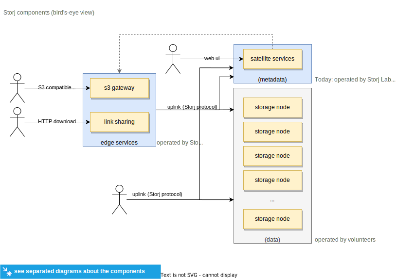

```


```

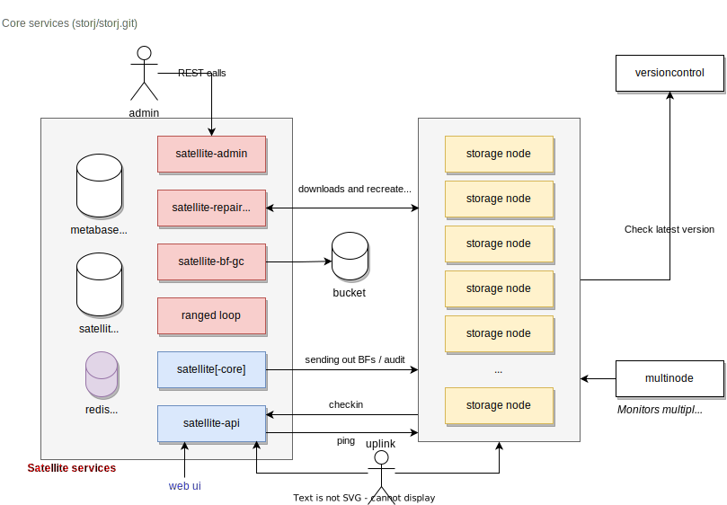

```


```

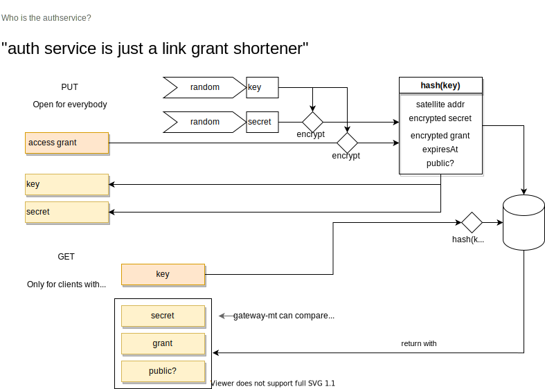

```


```

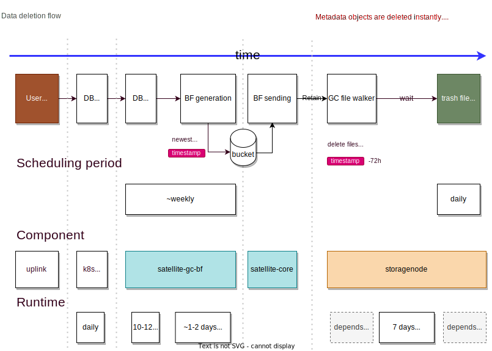

```


```

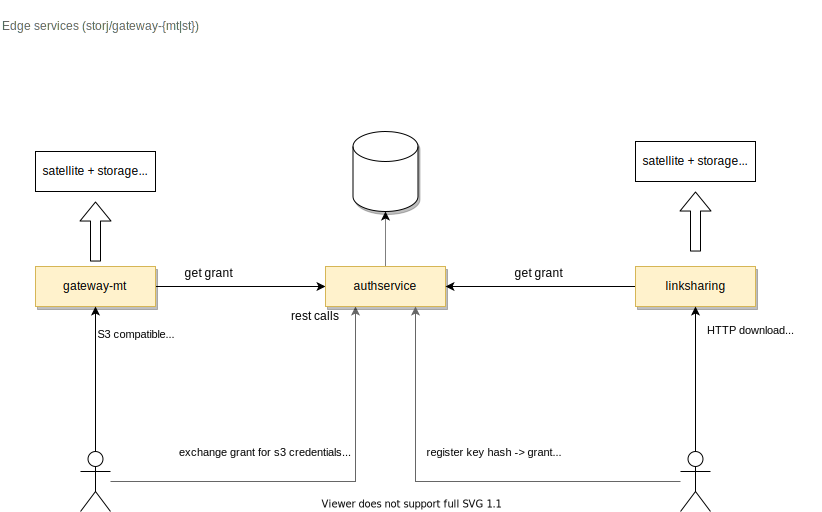

```


```

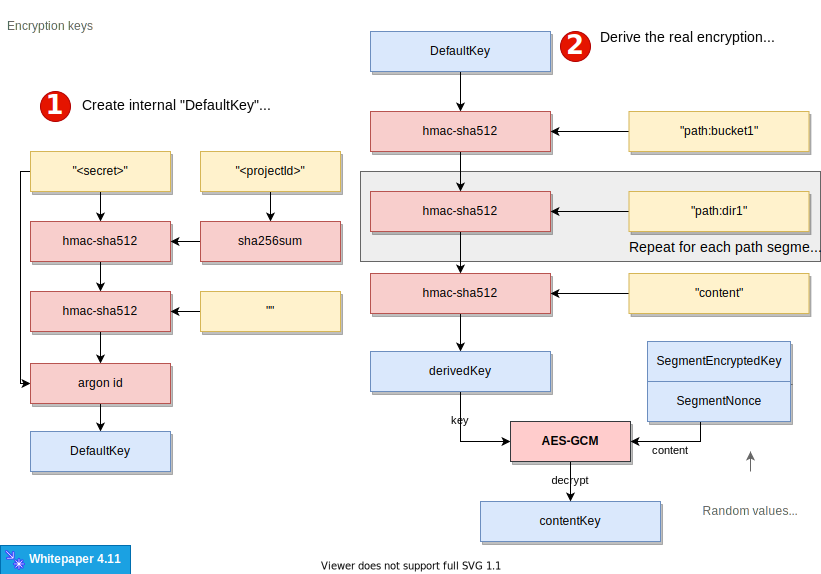

```


```

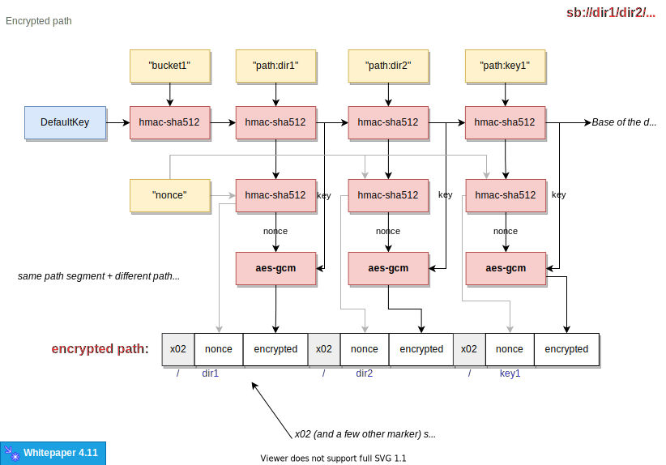

```


```

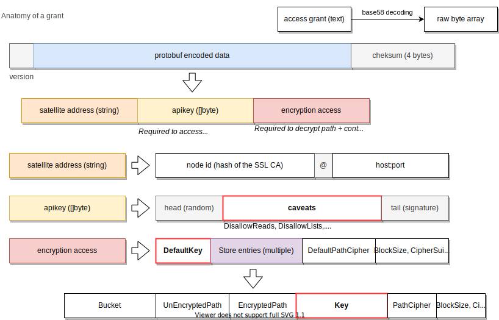

```


```

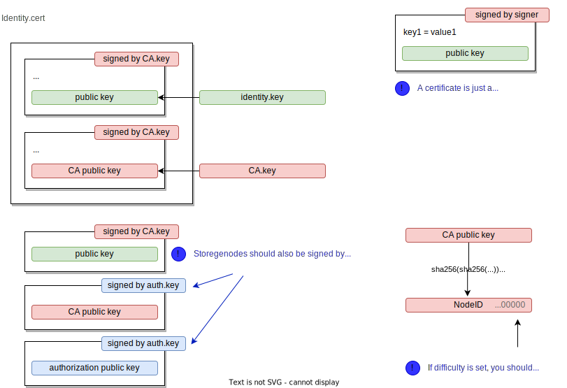

```


```

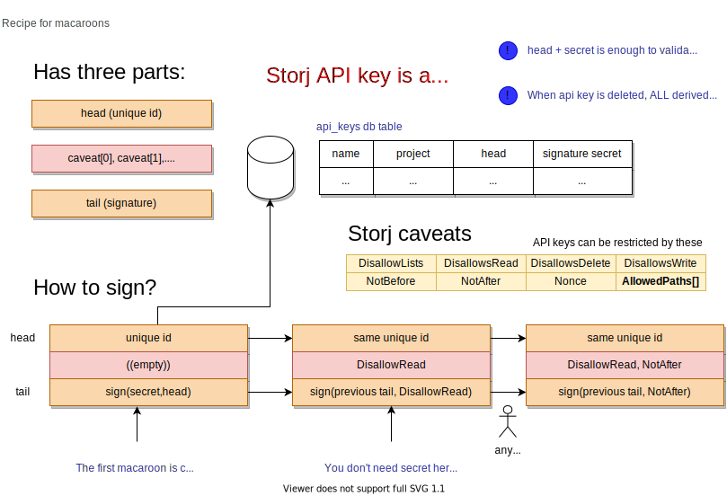

```


```

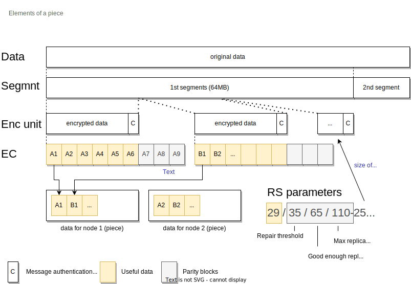

```


```


```


```

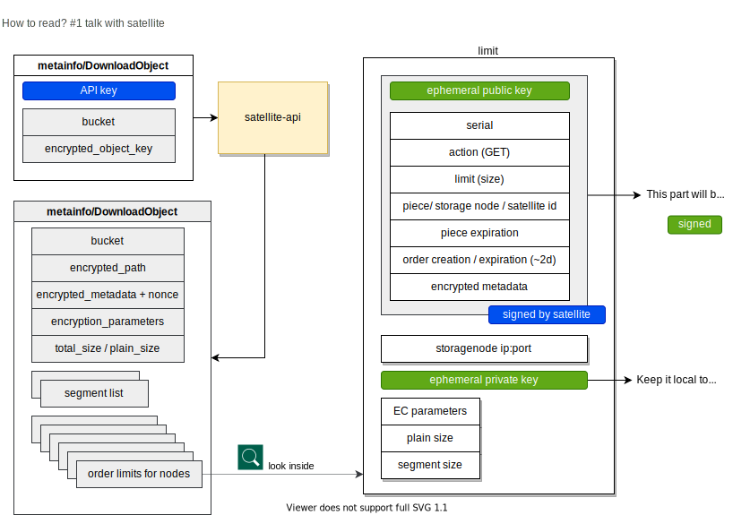

```


```


```


```


```


```

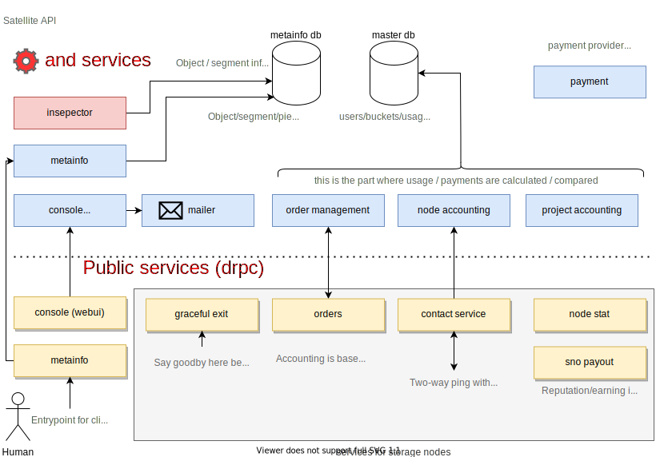

```


```

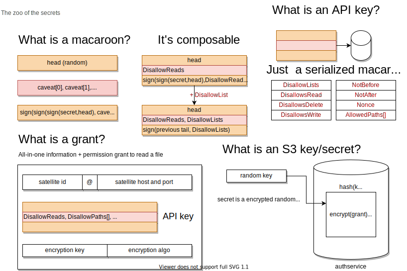

```


```


```


```

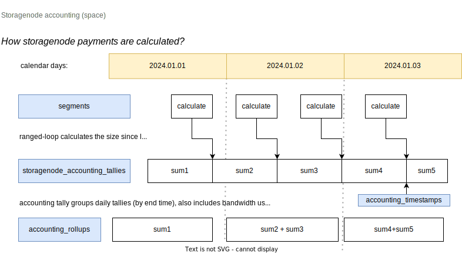

```


```

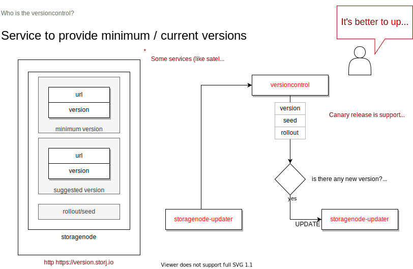

## How to contribute

Original source of the diagrams can be edited with online or offline version of [diagrams.net](https://app.diagrams.net)

When one diagram is saved, both the export (svg) both the embedded source are updated. 

PR can be created where the old version and new version of the SVG can be seen, just click to the *rich diff* option:


To regenerate the previews, the following can be used (after existing lines are removed):

```
ls -1 docs/*.svg | sort | xargs -n1 -IFILE printf "\n\n```\n\n\n\n```\n\n"         
```

(tested in fish)

